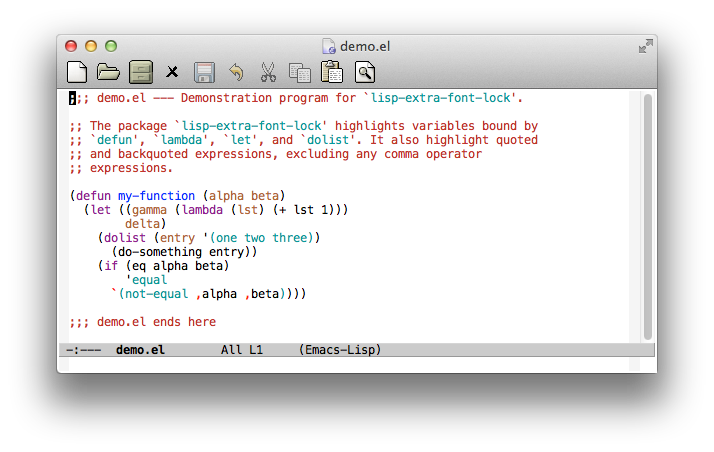

# lisp-extra-font-lock - Highlight bound variables and quoted exprs

*Author:* Anders Lindgren 
*Version:* 0.0.4 
*URL:* [https://github.com/Lindydancer/lisp-extra-font-lock](https://github.com/Lindydancer/lisp-extra-font-lock) 

This package highlight the location where local variables is
created (bound, for example by `let`) as well as quoted and
backquoted constant expressions.

## Example

Below, `^` is used indicate highlighted normal variables and
constant expressions. `*` is used to show highlighting of special
variables (i.e. those defined by `defvar`) and of the backquote and
comma operators.

    (defun my-function (next)
                        ^^^^             <- Parameters
      (let ((numbers '(one two three))
             ^^^^^^^  ^^^^^^^^^^^^^^^    <- Var bound by `let` and quoted expr.
            (buffer-read-only t))
             ****************            <- Special variable (different color)
        `(,@numbers and ,next)))
        *^**        ^^^ *    ^           <- Backquote and comma

### Screenshot

## What is highlighted

* Parameters in functions and lambdas
* Variables bound by the special functions `let`, `dolist`, and
  `condition-case`, and other functions with the same form. Special
  (global) variables rebound by `let` is highlighted in a different
  color, as a warning
* Quoted expressions
* Backquoted expressions. Subexpressions using the "," or ",@" are
  not highlighted (as they are evaluted and thus not constant).
  Also, the backquote and the comma operators themselves are
  highlighted using a bright color as a warning.
* Hash-quoted symbols.

## Installation

Place this package in a directory in the load-path. To activate it,
use *customize* or place the following lines in a suitable init
file:

       (require 'lisp-extra-font-lock-mode)
       (lisp-extra-font-lock-global-mode 1)

## Customization

You can modify the following lists to add more functions that are
recognized:

* `lisp-extra-font-lock-let-functions` -- List of function with the
  same syntax as `let`
* `lisp-extra-font-lock-defun-functions` -- List of function with
  the same syntax as `defun`
* `lisp-extra-font-lock-lambda-functions` -- List of function with
  the same syntax as `lambda`
* `lisp-extra-font-lock-dolist-functions` -- List of function with
  the same syntax as `dolist`
* `lisp-extra-font-lock-bind-first-functions` -- List of function
  that bind their first argument, like `condition-case`.
* `lisp-extra-font-lock-loop-functions` -- List of functions with
  the same syntax as `cl-loop`.

The following faces are used when highlighting. You can either
redefine the face (e.g. using a theme), or you can rebind the
corresponding variable.

* Local variables are highlighted using the standard face
  `font-lock-variable-name-face`
* Special (global) variables that are rebound by `let` are
  highlighted using the face bound to the variable
  `lisp-extra-font-lock-special-variable-name-face` (by default
  `lisp-extra-font-lock-special-variable-name`, which inherits from
  `font-lock-warning-face`)
* Quoted expressions use the face bound to the variable
  `lisp-extra-font-lock-quoted-face` (by default
  `lisp-extra-font-lock-quoted`, which inherits from
  `font-lock-constant-face`)
* The backquote and comma operators use the face bound to the
  variable `lisp-extra-font-lock-backquote-face` (by default
  `lisp-extra-font-lock-backquote`, which inherits from
  `font-lock-warning-face`).
* Named arguments to `cl-loop` are highlighted using
  `font-lock-builtin-face`.

### Example

To set the face used to highlight quoted expressions to a gray
color, you can use:

        (custom-set-faces
          '(lisp-extra-font-lock-quoted ((t :foreground "grey50"))))

---
Converted from `lisp-extra-font-lock.el` by [*el2markdown*](https://github.com/Lindydancer/el2markdown).
